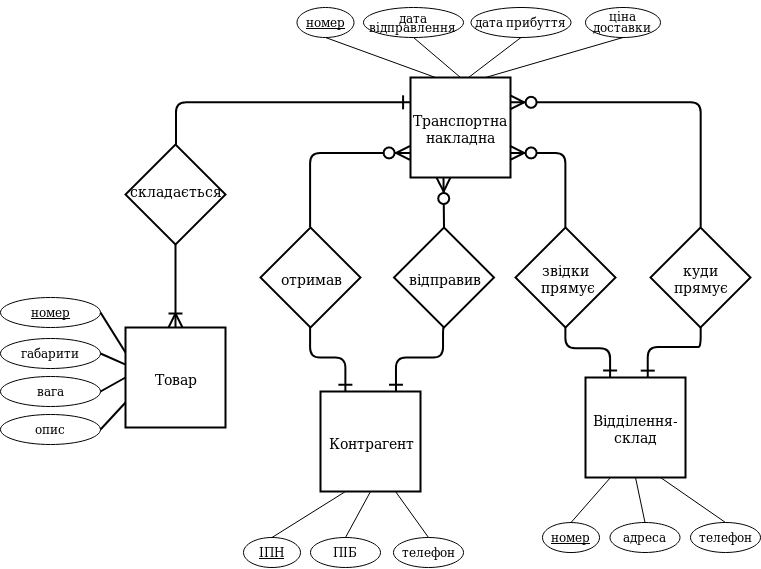

# Лабораторна робота No 1. Ознайомлення з базовими операціями СУБД PostgreSQL

## Завдання

[Постановка завдання](docs/lab1_bd_zu_2019_2020.pdf)

## Предметна галузь

Логістична компанія (транспортна накладна, їх реєстр, контрагент, склад-відділення)

## Графічне представлення моделі

