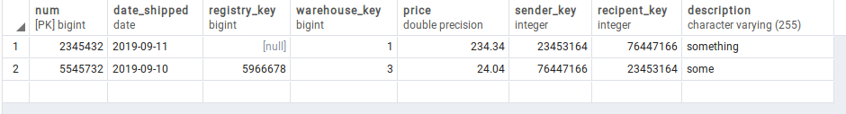
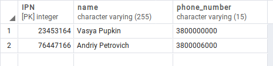
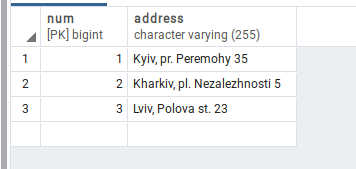

# Лабораторна робота No 1. Ознайомлення з базовими операціями СУБД PostgreSQL

## Завдання

[Постановка завдання](docs/lab1_bd_zu_2019_2020.pdf)

## Предметна галузь

Логістична компанія (транспортна накладна, їх реєстр, контрагент, склад-відділення)

## Графічне представлення моделі


## Вміст таблиць бази даних

### Invoices



### Contragents



### Registries


### Warehouses



## Структура бази даних

### Invoices sql

```sql
CREATE TABLE public.invoices
(
    num bigint NOT NULL DEFAULT nextval('invoices_num_seq'::regclass),
    date_shipped date NOT NULL,
    registry_key bigint DEFAULT nextval('invoices_registry_key_seq'::regclass),
    warehouse_key bigint NOT NULL DEFAULT nextval('invoices_warehouse_key_seq'::regclass),
    price double precision NOT NULL,
    sender_key integer NOT NULL,
    recipent_key integer NOT NULL,
    description character varying(255) COLLATE pg_catalog."default",
    CONSTRAINT invoices_pkey PRIMARY KEY (num),
    CONSTRAINT recipent_key FOREIGN KEY (recipent_key)
        REFERENCES public.contragents ("IPN") MATCH SIMPLE
        ON UPDATE NO ACTION
        ON DELETE NO ACTION,
    CONSTRAINT registry_key FOREIGN KEY (registry_key)
        REFERENCES public.registries (num) MATCH SIMPLE
        ON UPDATE NO ACTION
        ON DELETE NO ACTION,
    CONSTRAINT sender_key FOREIGN KEY (sender_key)
        REFERENCES public.contragents ("IPN") MATCH SIMPLE
        ON UPDATE NO ACTION
        ON DELETE NO ACTION,
    CONSTRAINT warehouse_key FOREIGN KEY (warehouse_key)
        REFERENCES public.warehouses (num) MATCH SIMPLE
        ON UPDATE NO ACTION
        ON DELETE NO ACTION
)
```

### Contragents sql

```sql
CREATE TABLE public.contragents
(
    "IPN" integer NOT NULL,
    name character varying(255) COLLATE pg_catalog."default" NOT NULL,
    phone_number character varying(15) COLLATE pg_catalog."default" NOT NULL,
    CONSTRAINT contragents_pkey PRIMARY KEY ("IPN")
)
```

### Registries sql

```sql
CREATE TABLE public.registries
(
    num bigint NOT NULL DEFAULT nextval('registries_num_seq'::regclass),
    name character varying(255) COLLATE pg_catalog."default",
    owner_key integer NOT NULL,
    CONSTRAINT registries_pkey PRIMARY KEY (num),
    CONSTRAINT owner_key FOREIGN KEY (owner_key)
        REFERENCES public.contragents ("IPN") MATCH SIMPLE
        ON UPDATE NO ACTION
        ON DELETE NO ACTION
)
```

### Warehouses sql

```sql
CREATE TABLE public.warehouses
(
    num bigint NOT NULL DEFAULT nextval('warehouses_num_seq'::regclass),
    address character varying(255) COLLATE pg_catalog."default" NOT NULL,
    CONSTRAINT warehouses_pkey PRIMARY KEY (num)
)
```
