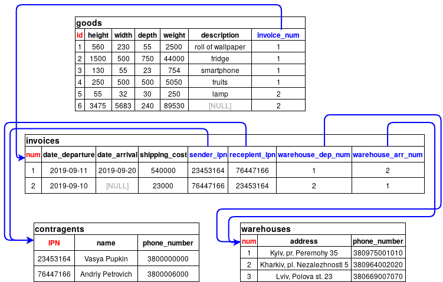
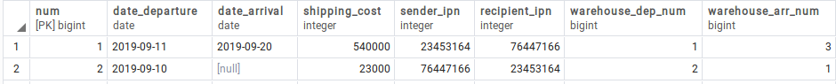
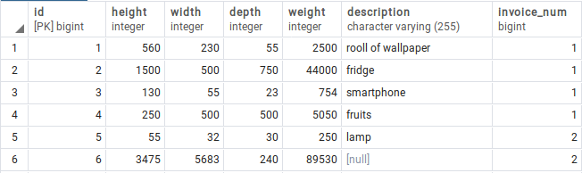
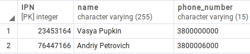
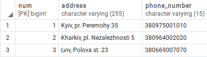

# Лабораторна робота No 1. Ознайомлення з базовими операціями СУБД PostgreSQL

## Завдання

[Постановка завдання](docs/lab1_bd_zu_2019_2020.pdf)

## Предметна галузь

Доставка вантажів (транспортна накладна, товари, контрагент, склад-відділення)

## Графічне представлення моделі


## Структура бази даних

### Структура таблиць бази даних



### Опис структури бази даних

| Відношення | Атрибут | Тип диних (розмір) |
|------------|---------|--------------------|
| _Відношення "**Invoices**"_ <br> Вміщує інформацію про транспортні накладні | <span style="color:red">_num_</span> — унікальний номер накладної <br> _date_departure_ — дата оформлення та відправлення посилки <br> _date_arrival_ — дата прибуття посилки. Допускає NULL <br> _shipping_cost_ — вартість доставки в коп. (1/100 UAH) <br> <span style="color:blue">_sender_ipn_</span> — ІПН відправника <br> <span style="color:blue">_recipient_ipn_</span> — ІПН отримувача  <br> <span style="color:blue">_warehouse_dep_num_</span> — номер складу, з якого відправлено посилку<br> <span style="color:blue">_warehouse_arr_num_</span> — номер складу до якого прямує посилка | Числовий <br> Дата <br> Дата <br> Числовий <br> Числовий <br> Числовий <br> Числовий <br> Числовий <br>  |
| _Відношення "**Goods**"_ <br> Вміщує інформацію про товари та вантажі, що перевозяться однією накладною | <span style="color:red">_id_</span> — унікальний ідентифікатор товару <br> _height_ — висота посилки в мм <br> _width_ — ширина посилки в мм <br> _depth_ — глибина посилки в мм <br> _weight_ — вага посилки в грамах (г) <br> _description_ — опис вантажу. Допускає NULL <br> <span style="color:blue">_invoice_num_</span> — номер накладної, до якої належить ця посилка | Числовий <br> Числовий <br> Числовий <br> Числовий <br> Числовий <br> Текстовий (255) <br> Числовий |
| _Відношення "**Contragents**"_ <br> Вміщує інформацію про осіб, які є відправниками або отрмувачами | <span style="color:red">_IPN_</span> — ідентифікаційний податковий номер особи (ІПН) <br> _name_ — ПІБ особи <br> _phone_number_ — мобільний номер телефона особи | Числовий <br> Текстовий (255) <br> Текстовий (15) |
| _Відношення "**Warehouses**"_ <br> Вміщує інформацію про склади, між якими транспортуються вантажі | <span style="color:red">_num_</span> — унікальний номер складу <br> _address_ — адреса, за якою знаходиться склад <br> _phone_number_ — контактний номер телефону довідкового відділу | Числовий <br> Текстовий (255) <br> Текстовий (15) |

### Structure via SQL

#### Invoices sql

```sql
CREATE TABLE public.invoices
(
    num bigint NOT NULL DEFAULT nextval('invoices_num_seq'::regclass),
    date_departure date NOT NULL,
    date_arrival date,
    shipping_cost integer NOT NULL,
    sender_ipn integer NOT NULL,
    recipient_ipn integer NOT NULL,
    warehouse_dep_num bigint NOT NULL DEFAULT nextval('invoices_warehouse_dep_num_seq'::regclass),
    warehouse_arr_num bigint NOT NULL DEFAULT nextval('invoices_warehouse_arr_num_seq'::regclass),
    CONSTRAINT invoices_pkey PRIMARY KEY (num),
    CONSTRAINT recipient_ipn FOREIGN KEY (recipient_ipn)
        REFERENCES public.contragents ("IPN") MATCH SIMPLE
        ON UPDATE NO ACTION
        ON DELETE NO ACTION,
    CONSTRAINT sender_ipn FOREIGN KEY (sender_ipn)
        REFERENCES public.contragents ("IPN") MATCH SIMPLE
        ON UPDATE NO ACTION
        ON DELETE NO ACTION,
    CONSTRAINT warehouse_arr_num FOREIGN KEY (warehouse_arr_num)
        REFERENCES public.warehouses (num) MATCH SIMPLE
        ON UPDATE NO ACTION
        ON DELETE NO ACTION,
    CONSTRAINT warehouse_dep_num FOREIGN KEY (warehouse_dep_num)
        REFERENCES public.warehouses (num) MATCH SIMPLE
        ON UPDATE NO ACTION
        ON DELETE NO ACTION
)
```

#### Goods sql

```sql
CREATE TABLE public.goods
(
    id bigint NOT NULL DEFAULT nextval('goods_id_seq'::regclass),
    height integer NOT NULL,
    width integer NOT NULL,
    depth integer NOT NULL,
    weight integer NOT NULL,
    description character varying(255) COLLATE pg_catalog."default",
    invoice_num bigint NOT NULL DEFAULT nextval('goods_invoice_num_seq'::regclass),
    CONSTRAINT goods_pkey PRIMARY KEY (id),
    CONSTRAINT invoice_num FOREIGN KEY (invoice_num)
        REFERENCES public.invoices (num) MATCH SIMPLE
        ON UPDATE NO ACTION
        ON DELETE NO ACTION
)
```

#### Contragents sql

```sql
CREATE TABLE public.contragents
(
    "IPN" integer NOT NULL,
    name character varying(255) COLLATE pg_catalog."default" NOT NULL,
    phone_number character varying(15) COLLATE pg_catalog."default" NOT NULL,
    CONSTRAINT contragents_pkey PRIMARY KEY ("IPN")
)
```

#### Warehouses sql

```sql
CREATE TABLE public.warehouses
(
    num bigint NOT NULL DEFAULT nextval('warehouses_num_seq'::regclass),
    address character varying(255) COLLATE pg_catalog."default" NOT NULL,
    phone_number character varying(15) COLLATE pg_catalog."default" NOT NULL,
    CONSTRAINT warehouses_pkey PRIMARY KEY (num)
)
```

## Вміст таблиць бази даних

### Invoices



### Goods



### Contragents



### Warehouses


