# Лабораторна робота No 2. Ознайомлення з базовими операціями СУБД PostgreSQL

## Завдання

[Постановка завдання](docs/lab2_bd_part1_2019_2020.pdf)

## Варіант завданн

6 варіант згідно номера залікової книжки

| Пошук за атрибутами | Повнотекстовий пошук |
|---------------------|----------------------|
| діапазон чисел, перелічення | слово не входить, обов’язкове входження слова |

## Нормалізована модель даних

У порівнянні з попередньої лабораторною роботою, було стоврено відношення `cities`,
при приведення відношення `warehouses` до 1НФ: а саме, ключ `address` було поділено
на атомарні частини: місто, та назву вулиці з номером будинку.

Тому у відношеннях зберігаються атомарні дані, у якості `primary key` всюди виступає
лише один атрибут, та транзитивних залежностей другорядних атрибутів від первинних
не знайдено. А отже розроблена БД цілком перебуває у 3НФ.

| Відношення | Атрибут | Тип диних (розмір) |
|------------|---------|--------------------|
| _Відношення "**Invoices**"_ <br> Вміщує інформацію про транспортні накладні | <span style="color:red">_num_</span> — унікальний номер накладної <br> _date_departure_ — дата оформлення та відправлення посилки <br> _date_arrival_ — дата прибуття посилки. Допускає NULL <br> _shipping_cost_ — вартість доставки в коп. (1/100 UAH) <br> <span style="color:blue">_sender_ipn_</span> — ІПН відправника <br> <span style="color:blue">_recipient_ipn_</span> — ІПН отримувача  <br> <span style="color:blue">_warehouse_dep_num_</span> — номер складу, з якого відправлено посилку<br> <span style="color:blue">_warehouse_arr_num_</span> — номер складу до якого прямує посилка | Числовий <br> Дата <br> Дата <br> Числовий <br> Числовий <br> Числовий <br> Числовий <br> Числовий <br>  |
| _Відношення "**Goods**"_ <br> Вміщує інформацію про товари та вантажі, що перевозяться однією накладною | <span style="color:red">_id_</span> — унікальний ідентифікатор товару <br> _height_ — висота посилки в мм <br> _width_ — ширина посилки в мм <br> _depth_ — глибина посилки в мм <br> _weight_ — вага посилки в грамах (г) <br> _description_ — опис вантажу. Допускає NULL <br> <span style="color:blue">_invoice_num_</span> — номер накладної, до якої належить ця посилка | Числовий <br> Числовий <br> Числовий <br> Числовий <br> Числовий <br> Текстовий (255) <br> Числовий |
| _Відношення "**Contragents**"_ <br> Вміщує інформацію про осіб, які є відправниками або отрмувачами | <span style="color:red">_IPN_</span> — ідентифікаційний податковий номер особи (ІПН) <br> _name_ — ПІБ особи <br> _phone_number_ — мобільний номер телефона особи | Числовий <br> Текстовий (255) <br> Текстовий (15) |
| _Відношення "**Warehouses**"_ <br> Вміщує інформацію про склади, між якими транспортуються вантажі | <span style="color:red">_num_</span> — унікальний номер складу <br> _city_id_ - унікальний ідентифікатор міста, в якому знаходиться склад <br> _address_ — назва вулиці та номер будівлі, за якою знаходиться склад <br> _phone_number_ — контактний номер телефону довідкового відділу | Числовий <br> Числовий <br> Текстовий (255) <br> Текстовий (15) |
| _Відношення "**Cities**"_ <br> Вміщує інформацію про міста, в яких знаходяться відділення | <span style="color:red">_id_</span> — унікальний номер міста <br> _name_ — наза міста | Числовий <br> Текстовий (255) |

### SQL

```sql
CREATE TABLE IF NOT EXISTS contragents
(
    IPN          int PRIMARY KEY,
    name         varchar(255) NOT NULL,
    phone_number char(15) NOT NULL
);

CREATE TABLE IF NOT EXISTS cities
(
    id   serial PRIMARY KEY,
    name varchar(255) NOT NULL
);

CREATE TABLE IF NOT EXISTS warehouses
(
    num          serial PRIMARY KEY,
    address      text NOT NULL,
    phone_number char(15) NOT NULL,
    city_id      serial NOT NULL,
    CONSTRAINT city_id FOREIGN KEY (city_id)
        REFERENCES cities (id)
        ON UPDATE RESTRICT
        ON DELETE RESTRICT
);

CREATE TABLE IF NOT EXISTS invoices
(
    num               serial PRIMARY KEY,
    date_departure    date NOT NULL,
    date_arrival      date,
    shipping_cost     money NOT NULL,
    sender_ipn        int NOT NULL,
    recipient_ipn     int NOT NULL,
    warehouse_dep_num serial NOT NULL,
    warehouse_arr_num serial NOT NULL,
    CONSTRAINT recipient_ipn FOREIGN KEY (recipient_ipn)
        REFERENCES contragents (IPN)
        ON UPDATE RESTRICT
        ON DELETE RESTRICT,
    CONSTRAINT sender_ipn FOREIGN KEY (sender_ipn)
        REFERENCES contragents (IPN)
        ON UPDATE RESTRICT
        ON DELETE RESTRICT,
    CONSTRAINT warehouse_arr_num FOREIGN KEY (warehouse_arr_num)
        REFERENCES warehouses (num)
        ON UPDATE RESTRICT
        ON DELETE RESTRICT,
    CONSTRAINT warehouse_dep_num FOREIGN KEY (warehouse_dep_num)
        REFERENCES warehouses (num)
        ON UPDATE RESTRICT
        ON DELETE RESTRICT
);

CREATE TABLE IF NOT EXISTS goods
(
    id          serial PRIMARY KEY,
    height      int NOT NULL,
    width       int NOT NULL,
    depth       int NOT NULL,
    weight      int NOT NULL,
    description text,
    invoice_num serial NOT NULL,
    CONSTRAINT invoice_num FOREIGN KEY (invoice_num)
        REFERENCES invoices (num)
        ON UPDATE RESTRICT
        ON DELETE RESTRICT
);
CREATE INDEX IF NOT EXISTS goods_descriptions ON goods USING gin(to_tsvector('english', description));
```

## Лістинги програм з директивами внесення, редагування та вилучення даних у базі даних та результати виконання цих директив

`controller/__init__.py`

```python
class BaseController(ABC):
    def __init__(self, model: BaseModel, view: BaseView):
        self.__model = model
        self.__view = view
        self._cb_show_prev_state = None

    def show(self, pk: int = None):
        pk_not_specified = pk is None
        if pk_not_specified:
            pk = self.__view.get_item_pk('Reading')
        try:
            if isinstance(pk, str):
                pk = int(pk)
            item = self.__model.read(pk)
            self.__view.show_item(item)
        except (Exception, psycopg2.Error) as e:
            exception_handler(e, self.__model.rollback)
            self.__view.show_error(str(e))
        finally:
            if pk_not_specified:
                self.choose_operation()
            else:
                self.show_all()

    def insert(self):
        input_items = self.__get_input_items_form(self._prompt_values_for_input())
        command = self.__view.show_input_item_form(input_items, 'Create')
        if command == ConsoleCommands.GO_BACK:
            return self.choose_operation()
        if command == ConsoleCommands.CONFIRM:
            try:
                pk_name = self.__model.primary_key_name
                item = self.__model.create(self._create_obj_from_input(input_items))
                self.__view.show_created_item(item, pk_name)
            except (Exception, psycopg2.Error) as e:
                exception_handler(e, self.__model.rollback)
                self.__view.show_error(str(e))
            finally:
                self.choose_operation()

    def update(self):
        pk = self.__view.get_item_pk('Updating')
        try:
            if isinstance(pk, str):
                pk = int(pk)
            item = self.__model.read(pk)
            input_items = self.__get_input_items_form(self._prompt_values_for_input(item, True))
            command = self.__view.show_input_item_form(input_items, 'Update')
            if command == ConsoleCommands.GO_BACK:
                return self.choose_operation()
            if command == ConsoleCommands.CONFIRM:
                new_item = self._create_obj_from_input(input_items)
                pk_name = self.__model.primary_key_name
                setattr(new_item, pk_name, getattr(item, pk_name))
                self.__model.update(new_item)
                self.__view.show_updated_item(item, new_item)
        except (Exception, psycopg2.Error) as e:
            exception_handler(e, self.__model.rollback)
            self.__view.show_error(str(e))
        finally:
            self.choose_operation()

    def delete(self):
        pk = self.__view.get_item_pk('Deleting')
        try:
            if isinstance(pk, str):
                pk = int(pk)
            item = self.__model.read(pk)
            confirm = self.__view.confirm_deleting_form(item)
            if confirm.strip().lower() != "yes":
                return self.choose_operation()
            self.__model.delete(pk)
            self.__view.show_success(f"An item {item} was successfully deleted")
        except (Exception, psycopg2.Error) as e:
            exception_handler(e, self.__model.rollback)
            self.__view.show_error(str(e))
        finally:
            self.choose_operation()
```

### Процес внесення даних та його результат

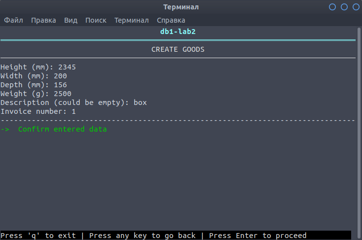

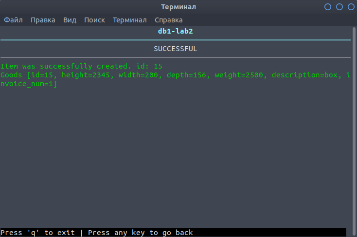

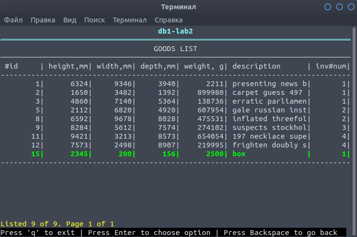

### Процес редагування, результат операцій

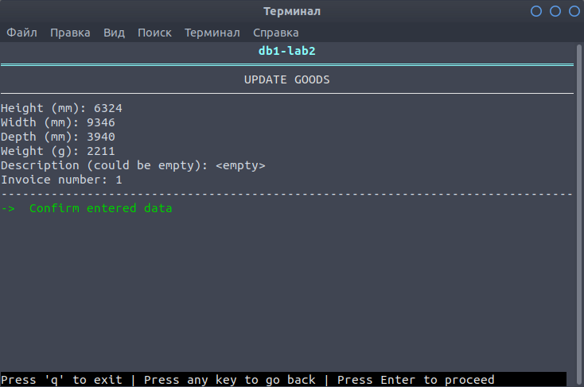

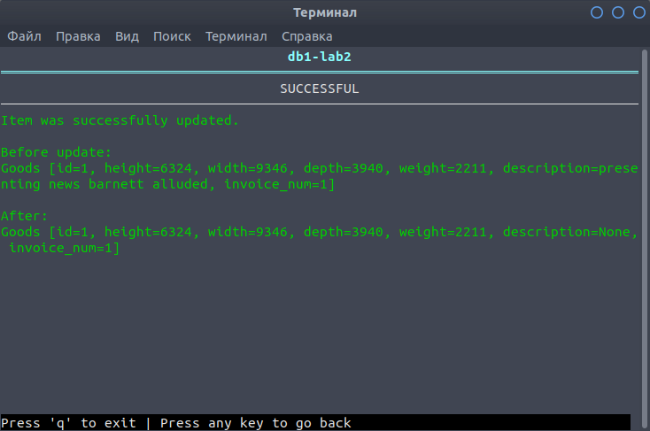

### Процес вилучення даних, результат операцій

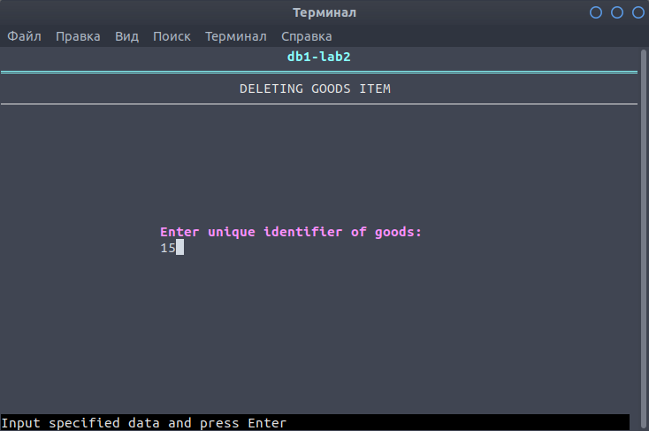

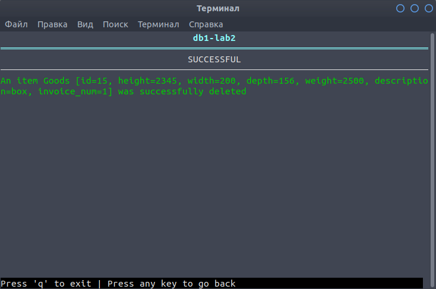

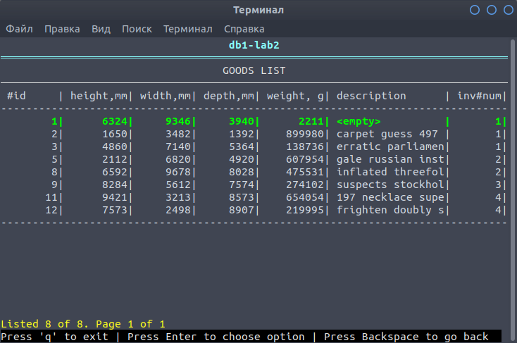

## Лістинги програм зі статичними та динамічними запитами пошуку

`model/common.py`

```python
    def filter_items(self, cost_from: int, cost_to: int, sender_name: str = None, recipient_name: str = None):
        query = "SELECT num, date_departure, date_arrival, shipping_cost, c1.name, " \
                "c1.phone_number, c2.name, c2.phone_number from invoices i " \
                "INNER JOIN contragents c1 on i.sender_ipn = c1.ipn " \
                "INNER JOIN contragents c2 on i.recipient_ipn = c2.ipn " \
                "WHERE " \
                "shipping_cost::numeric BETWEEN (%(min)s) AND (%(max)s)"
        if isinstance(sender_name, str):
            query += " AND c1.name = (%(sender)s)"
        if isinstance(recipient_name, str):
            query += " AND c2.name = (%(recipient)s)"
        self.__cursor.execute(query, {'min': cost_from, 'max': cost_to,
                                      'sender': sender_name, 'recipient': recipient_name})
        rows = self.__cursor.fetchall()
        if isinstance(rows, list):
            return rows
        else:
            raise Exception("There are no items")

    def fulltext_search(self, query: str, including: bool):
        if not including:
            words = query.split()
            if len(words) > 0:
                words[0] = "!" + words[0]
            counter = 1
            while counter < len(words):
                words[counter] = "& !" + words[counter]
            query = ' '.join(words)
        query_excluding = "SELECT ts_headline(description, q) " \
                          "FROM goods, to_tsquery('english', %(query)s) AS q " \
                          "WHERE to_tsvector('english', description) @@ q "
        query_including = "SELECT ts_headline(description, q) " \
                          "FROM goods, plainto_tsquery('english', %(query)s) AS q " \
                          "WHERE to_tsvector('english', description) @@ q "
        self.__cursor.execute(query_including if including else query_excluding, {'query': query})
        rows = self.__cursor.fetchall()
        if isinstance(rows, list):
            return rows
        else:
            raise Exception("There are no items")
```

## Лістинг модуля «модель» згідно із шаблоном MVC

`model/__init__.py`

```python
class BaseModel(ABC):
    def __init__(self, connection, insert_query, select_query, update_query,
                 delete_query, select_all_query, count_query, primary_key_name):
        self._connection = connection
        self._cursor = connection.cursor(cursor_factory=DictCursor)
        self.__insert_query = insert_query
        self.__select_query = select_query
        self.__update_query = update_query
        self.__delete_query = delete_query
        self.__select_all_query = select_all_query
        self.__count_query = count_query
        self.__primary_key_name = primary_key_name

    def create(self, item: object):
        should_return_id = "returning" in self.__insert_query.lower()
        if not self._is_valid_item_dict(item.__dict__, not should_return_id):
            raise Exception("Item is not valid")
        self._cursor.execute(self.__insert_query, item.__dict__)
        self._connection.commit()
        if should_return_id:
            row = self._cursor.fetchone()
            if row is not None and isinstance(row[self.__primary_key_name], int):
                self.__insert_pk_in_item(item, row[self.__primary_key_name])
                return item
            else:
                raise Exception("No rows received from DB")

    def read(self, pk: int):
        if not isinstance(pk, int):
            raise Exception("Primary key should be an integer")
        self._cursor.execute(self.__select_query, [pk])
        row = self._cursor.fetchone()
        if row is not None and self._is_valid_item_dict(row):
            return self._get_item_from_row(row)
        else:
            raise Exception(f"No item with such primary key {pk} was found")

    def read_all(self, offset: int = 0, limit: int = None):
        self._cursor.execute(self.__select_all_query, {'limit': limit, 'offset': offset})
        rows = self._cursor.fetchall()
        if isinstance(rows, list) and all(self._is_valid_item_dict(row) for row in rows):
            return [self._get_item_from_row(row) for row in rows]
        else:
            raise Exception("There are no items")

    def update(self, item: object):
        if not self._is_valid_item_dict(item.__dict__):
            raise Exception("Item is not valid")
        self._cursor.execute(self.__update_query, item.__dict__)
        self._connection.commit()

    def delete(self, pk: int):
        if not isinstance(pk, int):
            raise Exception("Primary key should be an integer")
        self._cursor.execute(self.__delete_query, [pk])
        self._connection.commit()
```

`model/goods.py`

```python
class Goods:
    def __init__(self, height: int, width: int, depth: int, weight: int,
                 invoice_num: int,  description: str = None, g_id: int = None):
        self.id = g_id
        self.height = height
        self.width = width
        self.depth = depth
        self.weight = weight
        self.description = description
        self.invoice_num = invoice_num

    def __str__(self):
        return f"Goods [id={self.id}, height={self.height}, width={self.width}, depth={self.depth}, " \
               f"weight={self.weight}, description={self.description}, invoice_num={self.invoice_num}]"


class GoodsModel(BaseModel):
    def __init__(self, connection):
        insert_query = "INSERT INTO goods (height, width, depth, weight, description, invoice_num) " \
                       "VALUES (%(height)s, %(width)s, %(depth)s, %(weight)s, %(description)s, %(invoice_num)s)" \
                       "RETURNING id"
        select_query = "SELECT * FROM goods WHERE id = %s"
        update_query = "UPDATE goods SET height = %(height)s, width = %(width)s, depth = %(depth)s, " \
                       "weight = %(weight)s, description = %(description)s, invoice_num = %(invoice_num)s " \
                       "WHERE id = %(id)s"
        delete_query = "DELETE FROM goods WHERE id = %s"
        select_all_query = "SELECT * FROM goods ORDER BY id OFFSET %(offset)s LIMIT %(limit)s"
        count_query = "SELECT COUNT(*) FROM goods"
        primary_key_name = "id"
        super().__init__(connection, insert_query, select_query, update_query,
                         delete_query, select_all_query, count_query, primary_key_name)
```

## Скріншоти результатів виконання операції вилучення запису батьківської таблиці та виведення вмісту дочірньої таблиці після цього вилучення, а якщо воно неможливе, то результат перехоплення помилки з виведенням повідомлення про неможливість видалення за наявності залежних даних

Список накладних:

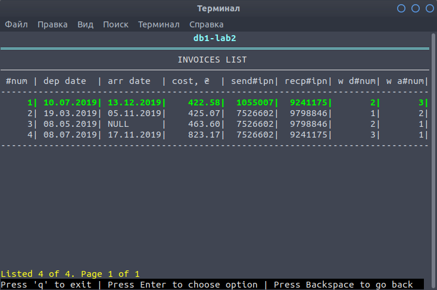

Список товарів:

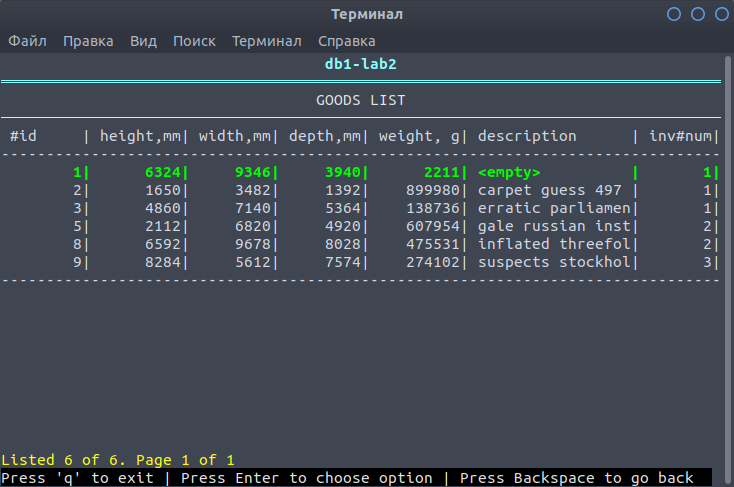

Як бачимо, тільки накладна №4 немає товарів

Видалимо цю накладну:


Як бачимо результат успішний:

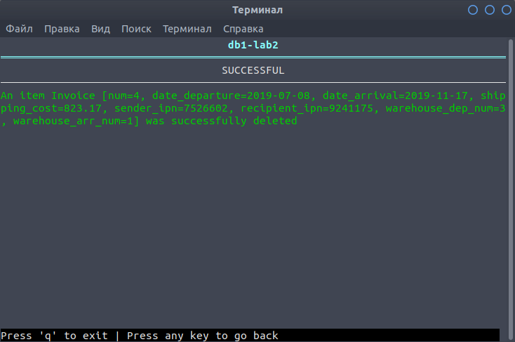

Спробуємо видалити іншу накладну:

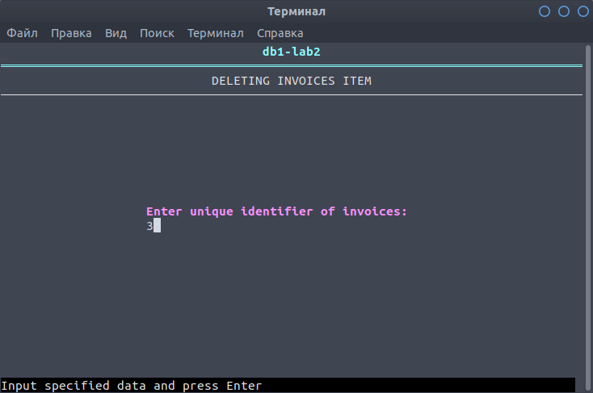

Отримуємо помилку:

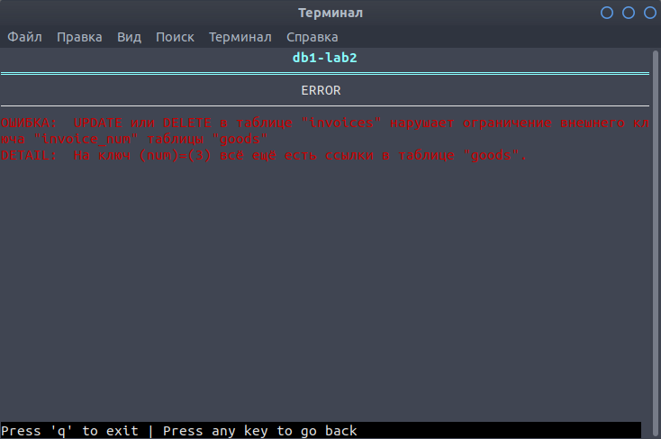

Список накладних після зроблених операцій:

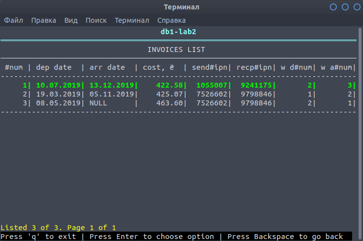
