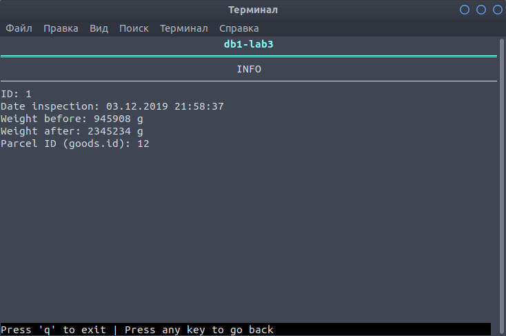
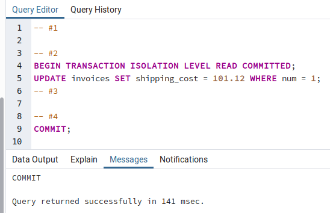

# Лабораторна робота No 3. Засоби оптимізації роботи СУБД PostgreSQL

## Завдання

[Постановка завдання](docs/lab3_bd_zu_2019_2020.pdf.pdf)

## Варіант завданн

6 варіант згідно номера залікової книжки

| Види індексів | Умови для тригера    |
|---------------|----------------------|
| BTree, BRIN   | after update, insert |

## Mодель бази даних

| Відношення | Атрибут | Тип диних (розмір) |
|------------|---------|--------------------|
| _Відношення "**Invoices**"_ <br> Вміщує інформацію про транспортні накладні | <span style="color:red">_num_</span> — унікальний номер накладної <br> _date_departure_ — дата оформлення та відправлення посилки <br> _date_arrival_ — дата прибуття посилки. Допускає NULL <br> _shipping_cost_ — вартість доставки в коп. (1/100 UAH) <br> <span style="color:blue">_sender_ipn_</span> — ІПН відправника <br> <span style="color:blue">_recipient_ipn_</span> — ІПН отримувача  <br> <span style="color:blue">_warehouse_dep_num_</span> — номер складу, з якого відправлено посилку<br> <span style="color:blue">_warehouse_arr_num_</span> — номер складу до якого прямує посилка | Числовий <br> Дата <br> Дата <br> Числовий <br> Числовий <br> Числовий <br> Числовий <br> Числовий <br>  |
| _Відношення "**Goods**"_ <br> Вміщує інформацію про товари та вантажі, що перевозяться однією накладною | <span style="color:red">_id_</span> — унікальний ідентифікатор товару <br> _height_ — висота посилки в мм <br> _width_ — ширина посилки в мм <br> _depth_ — глибина посилки в мм <br> _weight_ — вага посилки в грамах (г) <br> _description_ — опис вантажу. Допускає NULL <br> <span style="color:blue">_invoice_num_</span> — номер накладної, до якої належить ця посилка | Числовий <br> Числовий <br> Числовий <br> Числовий <br> Числовий <br> Текстовий (255) <br> Числовий |
| _Відношення "**Contragents**"_ <br> Вміщує інформацію про осіб, які є відправниками або отрмувачами | <span style="color:red">_IPN_</span> — ідентифікаційний податковий номер особи (ІПН) <br> _name_ — ПІБ особи <br> _phone_number_ — мобільний номер телефона особи | Числовий <br> Текстовий (255) <br> Текстовий (15) |
| _Відношення "**Warehouses**"_ <br> Вміщує інформацію про склади, між якими транспортуються вантажі | <span style="color:red">_num_</span> — унікальний номер складу <br> _city_id_ - унікальний ідентифікатор міста, в якому знаходиться склад <br> _address_ — назва вулиці та номер будівлі, за якою знаходиться склад <br> _phone_number_ — контактний номер телефону довідкового відділу | Числовий <br> Числовий <br> Текстовий (255) <br> Текстовий (15) |
| _Відношення "**Cities**"_ <br> Вміщує інформацію про міста, в яких знаходяться відділення | <span style="color:red">_id_</span> — унікальний номер міста <br> _name_ — наза міста | Числовий <br> Текстовий (255) |
| _Відношення "**Reweightings**"_ <br> Вміщує інформацію про неспівпадіння реальної ваги з наданою після перезважування | <span style="color:red">_id_</span> — унікальний номер події <br> _date_inspection_ — дата, коли відбулося перезважування <br> _weight_before_ — заявлена вага, г <br> _weight_after_ — реальна вага, г  <br> <span style="color:blue">_parcel_id_</span> — унікальний номер посилки, яку перезважували | Числовий <br> Дата <br> Числовий <br> Числовий <br> Числовий|

### Візуалізація


## Завдання №1: оновлений програмний код

`model/__init__.py`

```python
class Model:
    def __init__(self, session: Session, cls: Type):
        self.__session = session
        self._cls = cls

    def create(self, item: object):
        self.__session.add(item)
        self.__commit_or_rollback_on_failure()
        return item

    def create_many(self, items: [object]):
        self.__session.add_all(items)
        self.__commit_or_rollback_on_failure()
        return items

    def read(self, pk: int):
        item = self.__session.query(self._cls).get(pk)
        if item is None:
            raise Exception(f"No item with such primary key {pk} was found")
        return item

    def read_all(self, offset: int = 0, limit: int = None):
        pk_name = self.get_primary_key_name()
        items = self.__session.query(self._cls).order_by(asc(pk_name)).offset(offset).limit(limit).all()
        return items

    def count_all(self):
        return self.__session.query(self._cls).count()

    def update(self, item: dict):
        pk_name = self.get_primary_key_name()
        pk = item[pk_name]
        try:
            self.__session.query(self._cls).filter_by(**{pk_name: pk}).update(item)
            self.__session.commit()
        except Exception:
            self.__session.rollback()
            raise
        return self.read(pk)

    def delete(self, pk: int):
        pk_name = self.get_primary_key_name()
        try:
            self.__session.query(self._cls).filter_by(**{pk_name: pk}).delete()
            self.__session.commit()
        except Exception:
            self.__session.rollback()
            raise
```

`model/city.py`

```python
class City(Base):
    __tablename__ = 'cities'

    id = Column(Integer, primary_key=True)
    name = Column(String, nullable=False)

    def __str__(self):
        return f"City [id={self.id}, name={self.name}]"
```

`model/contragent.py`

```python
class Contragent(Base):
    __tablename__ = 'contragents'

    ipn = Column(Integer, primary_key=True, autoincrement=False)
    name = Column(String, nullable=False)
    phone_number = Column(String(15), nullable=False)

    def __str__(self):
        return f"Contragent [ipn={self.ipn}, name={self.name}, phone_number={self.phone_number}]"

    @staticmethod
    def get_distinct_names(session: Session):
        return [name for (name,) in session.query(Contragent.name).all()]
```

`model/goods.py`

```python
class Goods(Base):
    __tablename__ = 'goods'

    id = Column(Integer, primary_key=True)
    height = Column(Integer, nullable=False)
    width = Column(Integer, nullable=False)
    depth = Column(Integer, nullable=False)
    weight = Column(Integer, nullable=False)
    description = Column(Text)
    invoice_num = Column(Integer, ForeignKey('invoices.num', onupdate='restrict', ondelete='restrict'), nullable=False)

    invoice = relationship("Invoice", backref="goods")

    __table_args__ = (
        Index(
            'goods_descriptions_index',
            func.to_tsvector('english', description),
            postgresql_using='gin'
        ),
        Index(
            'volume_index',
            height, width, depth,
            postgresql_using='brin'
        ),
        Index(
            'invoice_num_index',
            invoice_num,
            postgresql_using='btree'
        ),
    )

    def __str__(self):
        return f"Goods [id={self.id}, height={self.height}, width={self.width}, depth={self.depth}, " \
               f"weight={self.weight}, description={self.description}, invoice_num={self.invoice_num}]"
```

`model/invoice.py`

```python
class Invoice(Base):
    __tablename__ = 'invoices'

    num = Column(Integer, primary_key=True)
    date_departure = Column(Date, nullable=False)
    date_arrival = Column(Date)
    shipping_cost = Column(DECIMAL, nullable=False)
    sender_ipn = \
        Column(Integer, ForeignKey('contragents.ipn', onupdate='restrict', ondelete='restrict'), nullable=False)
    recipient_ipn = \
        Column(Integer, ForeignKey('contragents.ipn', onupdate='restrict', ondelete='restrict'), nullable=False)
    warehouse_dep_num = \
        Column(Integer, ForeignKey('warehouses.num', onupdate='restrict', ondelete='restrict'), nullable=False)
    warehouse_arr_num = \
        Column(Integer, ForeignKey('warehouses.num', onupdate='restrict', ondelete='restrict'), nullable=False)

    sender = relationship("Contragent", backref="invoices_outbox", foreign_keys=[sender_ipn])
    recipient = relationship("Contragent", backref="invoices_inbox", foreign_keys=[recipient_ipn])
    warehouse_arrival = relationship("Warehouse", backref="invoices_arriving", foreign_keys=[warehouse_arr_num])
    warehouse_departure = relationship("Warehouse", backref="invoices_departing", foreign_keys=[warehouse_dep_num])

    __table_args__ = (
        Index(
            'sender_ipn_index',
            sender_ipn,
            postgresql_using='btree'
        ),
        Index(
            'shipping_cost_index',
            shipping_cost,
            postgresql_using='brin'
        ),
    )

    def __str__(self):
        return f"Invoice [num={self.num}, date_departure={self.date_departure}, date_arrival={self.date_arrival}, " \
               f"shipping_cost={self.shipping_cost}, sender_ipn={self.sender_ipn}, " \
               f"recipient_ipn={self.recipient_ipn}, warehouse_dep_num={self.warehouse_dep_num}, " \
               f"warehouse_arr_num={self.warehouse_arr_num}]"

    @staticmethod
    def get_extremum_shipping_cost(session: Session):
        min_query = func.min(Invoice.shipping_cost)
        max_query = func.max(Invoice.shipping_cost)
        return session.query(min_query).scalar(), session.query(max_query).scalar()
```

`model/reweightings.py`

```python
class Reweightings(Base):
    __tablename__ = 'reweightings'

    id = Column(Integer, primary_key=True)
    weight_before = Column(Integer, nullable=False)
    weight_after = Column(Integer, nullable=False)
    date_inspection = Column(DateTime, nullable=False)
    parcel_id = Column(Integer, ForeignKey('goods.id', onupdate='restrict', ondelete='restrict'), nullable=False)

    parcel = relationship("Goods", backref="reweightings")

    __table_args__ = (
        Index(
            'date_inspection_index',
            date_inspection,
            postgresql_using='brin'
        ),
    )

    def __str__(self):
        return f"Reweightings [id={self.id}, weight_before={self.weight_before}, weight_after={self.weight_after}, " \
               f"date_inspection={self.date_inspection}, parcel_id={self.parcel_id}]"
```

`model/warehouse.py`

```python
class Warehouse(Base):
    __tablename__ = 'warehouses'

    num = Column(Integer, primary_key=True)
    address = Column(String, nullable=False)
    phone_number = Column(String(15), nullable=False)
    city_id = Column(Integer, ForeignKey('cities.id', ondelete='restrict', onupdate='restrict'), nullable=False)

    city = relationship("City", backref="warehouses")

    def __str__(self):
        return f"Warehouse [num={self.num}, address={self.address}, " \
               f"phone_number={self.phone_number}, city_id={self.city_id}]"
```

## Завдання №2: команди створення індексів, тексти і час виконання запитів SQL

...

## Завдання №3: команди, що ініціюють виконання тригера, текст тригера та скріншоти зі змінами у таблицях бази даних

### Лістинг коду тригера

```sql
-- Creating dictionary with bad words

CREATE TABLE IF NOT EXISTS prohibited_items_dict (
    id serial PRIMARY KEY,
    word varchar(255) NOT NULL
);

TRUNCATE prohibited_items_dict RESTART IDENTITY;
INSERT INTO prohibited_items_dict (word) VALUES ('aerosol'), ('gun'), ('batteries');

-- Trigger below

CREATE OR REPLACE function goods_trigger() returns trigger as $$
    declare
        description_with_time text;
        current_word prohibited_items_dict.word%TYPE;
    begin
        if old is not null and old.weight != new.weight then
            INSERT INTO reweightings (weight_before, weight_after, date_inspection, parcel_id)
                VALUES (old.weight, new.weight, current_timestamp, new.id);
        elseif old is null then
            description_with_time = coalesce(new.description, '') || ' added to db at: ' || current_timestamp::char(19);
            UPDATE goods SET description = description_with_time WHERE id = new.id;
        end if;
        for current_word in SELECT word FROM prohibited_items_dict loop
            if new.description ilike '%' || current_word || '%' then
                raise 'This item is prohibited';
            end if;
        end loop;
        return new;
        exception
            when no_data_found then
            when too_many_rows then
                raise 'Could not check description, try again later';
    end;
$$ language plpgsql;

DROP trigger IF EXISTS goods_helper on goods;
CREATE trigger goods_helper AFTER UPDATE OR INSERT on goods for each row EXECUTE procedure goods_trigger();
```

### При створенні або редагуванні інформації про посилку, до опису додається строка з датою занесення інформації


Було додано в опис поточну дату


Пересвідчуємося в цьому ще раз:


### Якщо опис містить заборонені речі, то при створенні або редагуванні інформації про посилку, виникне помилка і дія не відбудеться


### Якщо оператор перезважив та вніс нову вагу посилки, то відповідний запис роюиться в журналі




## Завдання №4: скріншоти з ходом виконання запитів та їх результатів у обох транзакціях по кожному рівню ізоляції

### READ COMMITTED

<table>
    <tr>
        <td>Transction #1</td>
        <td>Transction #2</td>
    </tr>
    <tr>
        <td>
            <pre lang="sql">
-- #1
BEGIN TRANSACTION ISOLATION LEVEL READ COMMITTED;
SELECT shipping_cost FROM invoices WHERE num = 1;
-- #2
<br>
-- #3
SELECT shipping_cost FROM invoices WHERE num = 1;
-- #4
<br>
-- #5
SELECT shipping_cost FROM invoices WHERE num = 1;
            </pre>
        </td>
        <td>
            <pre lang="sql">
-- #1
<br>
-- #2
BEGIN TRANSACTION ISOLATION LEVEL READ COMMITTED;
UPDATE invoices SET shipping_cost = 101.12 WHERE num = 1;
-- #3
<br>
-- #4
COMMIT;
<br>
<br>
            </pre>
        </td>
    </tr>
</table>





